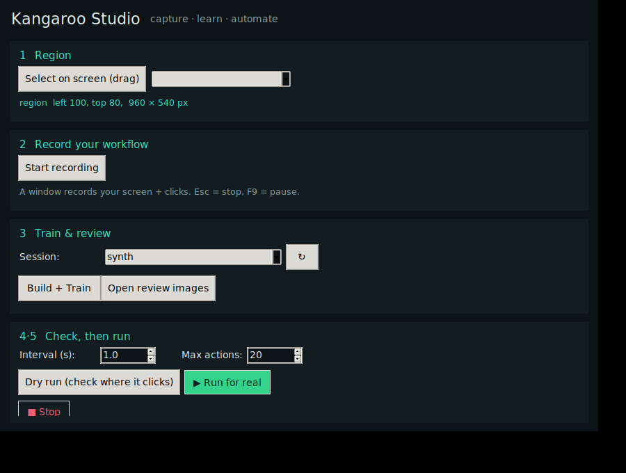

# Kangaroo Studio — the Windows app

A desktop program that runs the whole pipeline in one window: **pick a screen
region → record → train → review → check → run.** Built on Tkinter, which ships
with Python, so the GUI itself needs no extra install.



## Install & run

```
pip install -r ../rpa/requirements.txt        # torch, mss, pynput, pyautogui, pillow, numpy
python kangaroo_studio.py                       # from the test kangaroo/app folder
```

On Windows you can also just **double-click `run_studio.bat`**.

## The five steps (matches the window)

1. **Region** — click *Select on screen (drag)* and drag a box over the area you
   work in — any size, like a screen-capture tool — or pick a preset. The model
   resizes whatever region you choose to 64×64 internally, so **any size works**.
2. **Record** — *Start recording* opens the capture window. Do your task
   normally; it logs the screen + your clicks. **Esc** stops, **F9** pauses
   (use it before typing passwords).
3. **Train & review** — pick the session, *Build + Train*. Then
   *Open review images* to **see what it learned**: green = where you clicked,
   red = where the model would click. Close markers = it learned your target.
4. **Check** — *Dry run* shows in the log exactly where it **would** click, and
   clicks nothing. This is how you verify the automation before trusting it.
5. **Run** — *Run for real* performs the clicks (after a confirm + countdown).
   **Stop** or a mouse-to-corner or **Esc** aborts instantly.

## How it works

The GUI is thin: the region picker is native Tkinter, and every step shells out
to the tested scripts in `../rpa/` (`record_session.py`, `build_dataset.py`,
`train_clicker.py`, `run_agent.py`), streaming their output into the log pane.
That keeps the logic in small, verifiable scripts you can also run by hand.

## Notes & safety

- **Own machine and workflows only.** Don't point *Run* at a system whose rules
  forbid automation.
- **Keep secrets out of recordings** — F9 to pause, or record without keystrokes.
- **Multi-monitor:** the drag picker uses primary-screen coordinates; on a
  multi-display setup, prefer a region on the primary monitor (or type exact
  coordinates by running `../rpa/run_agent.py --region l,t,w,h` directly).
- The runner always keeps pyautogui's corner fail-safe on.
